# track-a-stock

A mockup of a simple full-stack brokerage web app made for simulating stock transactions and portfolio tracking. Originally developed for the CS50x course, this app will soon include additional features and improvements.

## Live Demo

Note: The live demo may take a few seconds to load due to free-tier hosting

**[https://track-a-stock.up.railway.app/](https://track-a-stock.up.railway.app/)**

## Features
- User Registration and Authentication
- Stock quote querying using live market data APIs
- Simulated Stock Buying, Selling, and Tracking

## System Architecture

The high-level system architecture is documented using Mermaid:

## Dependencies
- cs50
- flask
- flask-session
- gunicorn
- python-dotenv
- werkzeug

## Roadmap
- refactor: Decouple from CS50 module
- refactor: Switch to Postgres
- refactor: Switch to FastAPI
- test: Add automated tests
- feat: Dockerize app
- ~~refactor: Change directory layout~~
- ~~feat: Initialize venv with dependencies~~
- ~~refactor: Make app.py modular~~
- ~~feat: Implement light/dark mode~~
- ~~feat: Deploy using gunicorn~~
- ~~docs: Document system design and deployment~~